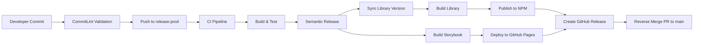

# Quanta Kit Angular - Semantic Release Setup

## 📋 Overview

This document outlines the complete semantic-release automation setup for the `quanta-kit-angular` project. The setup handles:

1. **Angular Library Publishing** - Automated npm package publishing
2. **Storybook Deployment** - Automated GitHub Pages deployment
3. **Version Management** - Semantic versioning with changelog generation
4. **Branch Synchronization** - Automated reverse-merge from release-prod to main

## 🏗️ Architecture



## 🔧 Configuration Files

### 1. Package.json Scripts

```json
{
  "scripts": {
    "build": "npm run sync-version && ng build",
    "sync-version": "node scripts/sync-version.js",
    "build-storybook": "ng run quanta-kit:build-storybook",
    "semantic-release": "semantic-release"
  }
}
```

### 2. Semantic Release Configuration (`.releaserc.json`)

```json
{
  "branches": [
    "release-prod",
    {
      "name": "main",
      "prerelease": "beta"
    }
  ],
  "plugins": [
    [
      "@semantic-release/commit-analyzer",
      {
        "preset": "angular",
        "releaseRules": [
          { "type": "feat", "release": "minor" },
          { "type": "fix", "release": "patch" },
          { "type": "perf", "release": "patch" },
          { "type": "docs", "scope": "readme", "release": "patch" },
          { "type": "refactor", "release": "patch" },
          { "breaking": true, "release": "major" }
        ]
      }
    ],
    [
      "@semantic-release/release-notes-generator",
      {
        "preset": "angular"
      }
    ],
    [
      "@semantic-release/changelog",
      {
        "changelogFile": "CHANGELOG.md"
      }
    ],
    [
      "@semantic-release/exec",
      {
        "prepareCmd": "npm run sync-version"
      }
    ],
    [
      "@semantic-release/npm",
      {
        "pkgRoot": "dist/quanta-kit",
        "tarballDir": "dist"
      }
    ],
    [
      "@semantic-release/git",
      {
        "assets": ["CHANGELOG.md", "package.json", "package-lock.json", "projects/quanta-kit/package.json"],
        "message": "chore(release): ${nextRelease.version} [skip ci]"
      }
    ],
    [
      "@semantic-release/github",
      {
        "assets": [
          {
            "path": "dist/*.tgz",
            "label": "NPM Package"
          }
        ]
      }
    ]
  ]
}
```

### 3. GitHub Actions Workflow (`.github/workflows/ci.yml`)

Key jobs added:
- **Release Job**: Builds library, publishes to npm, deploys Storybook
- **Reverse Merge Job**: Creates PR to sync main → develop

### 4. Version Synchronization Script (`scripts/sync-version.js`)

**Important Fix**: The library's `package.json` version synchronization was implemented to ensure both root and library packages have matching versions during semantic-release.

```javascript
#!/usr/bin/env node

import { readFileSync, writeFileSync } from 'fs';
import { join, dirname } from 'path';
import { fileURLToPath } from 'url';

const __dirname = dirname(fileURLToPath(import.meta.url));
const rootDir = join(__dirname, '..');

// Read the root package.json
const rootPackagePath = join(rootDir, 'package.json');
const rootPackage = JSON.parse(readFileSync(rootPackagePath, 'utf8'));

// Read the library package.json
const libPackagePath = join(rootDir, 'projects', 'quanta-kit', 'package.json');
const libPackage = JSON.parse(readFileSync(libPackagePath, 'utf8'));

// Update the library package version
libPackage.version = rootPackage.version;

// Write the updated library package.json
writeFileSync(libPackagePath, JSON.stringify(libPackage, null, 2) + '\n');

console.log(`✅ Synced library version to ${rootPackage.version}`);
```

**Why This Fix Was Needed:**
- Semantic-release only updates the root `package.json` by default
- The library's `package.json` in `projects/quanta-kit/` was not being updated
- NPM publishing would use the outdated library version
- The `@semantic-release/exec` plugin now runs the sync script at the correct time

## 🚀 Release Process

### Automatic Release Flow

1. **Commit Analysis**
   - Scans commits since last release
   - Determines release type (major/minor/patch)
   - Generates release notes

2. **Version Management** ⚡ FIXED
   - Updates root `package.json` with new semantic version
   - **Runs sync script** via `@semantic-release/exec` plugin
   - **Syncs version to library `package.json`** (Fixed: was not happening before)
   - Creates git tag

3. **Library Publishing**
   - Builds Angular library (`ng build`)
   - Publishes to npm registry as `quanta-kit`
   - Creates tarball in `dist/` folder

4. **Storybook Deployment**
   - Builds Storybook documentation
   - Deploys to GitHub Pages
   - Available at: `https://marvin-aroza.github.io/quanta-kit-angular/`

5. **GitHub Release**
   - Creates GitHub release with changelog
   - Attaches npm package tarball
   - Tags the release

6. **Branch Synchronization**
   - Creates reverse-merge branch
   - Opens PR: main → develop
   - Syncs version updates and changelog

## 📦 Release Types

Based on conventional commits:

| Commit Type | Release Type | Example |
|-------------|--------------|---------|
| `feat:` | Minor | `feat(TICKET-123): add new component` |
| `fix:` | Patch | `fix(TICKET-456): resolve button styling` |
| `BREAKING CHANGE:` | Major | `feat!: remove deprecated API` |
| `docs:` | Patch | `docs(readme): update installation guide` |
| `perf:` | Patch | `perf(TICKET-789): optimize bundle size` |

## ⚡ Version Sync Fix Implementation

### Problem Identified
During the initial setup, we discovered that semantic-release was only updating the root `package.json` but not the library's `package.json` in `projects/quanta-kit/`. This caused:
- NPM publishing with incorrect/outdated version numbers
- Mismatch between root project version and published library version
- Git commits showing only partial version updates

### Solution Implementation

**1. Added `@semantic-release/exec` Plugin**
```bash
npm install --save-dev @semantic-release/exec
```

**2. Updated `.releaserc.json` Plugin Order**
The order is crucial for proper execution:
```json
"plugins": [
  "@semantic-release/commit-analyzer",     // 1. Determine version
  "@semantic-release/release-notes-generator", // 2. Generate notes
  "@semantic-release/changelog",           // 3. Update changelog
  "@semantic-release/exec",               // 4. 🔧 Sync library version
  "@semantic-release/npm",                // 5. Publish with correct version
  "@semantic-release/git",                // 6. Commit both package.json files
  "@semantic-release/github"              // 7. Create GitHub release
]
```

**3. Created Dedicated Sync Script**
- Location: `scripts/sync-version.js`
- ES Module compatible (project uses `"type": "module"`)
- Robust error handling and logging
- Copies version from root to library package.json

**4. Verification**
```bash
# Test the sync manually
npm run sync-version

# Check both versions match
node -e "console.log('Root:', require('./package.json').version); console.log('Lib:', require('./projects/quanta-kit/package.json').version);"
```

### Timeline
- **Issue Discovered**: August 8, 2025
- **Fix Implemented**: August 8, 2025  
- **Status**: ✅ Resolved and tested

## 🔑 Required Setup

### 1. NPM Token Configuration

1. **Generate NPM Token:**
   ```bash
   npm login
   npm token create --access=automation
   ```

2. **Add to GitHub Secrets:**
   - Go to repository Settings → Secrets and variables → Actions
   - Add secret: `NPM_TOKEN` with the generated token

### 2. GitHub Pages Setup

1. **Enable GitHub Pages:**
   - Go to repository Settings → Pages
   - Source: Deploy from a branch
   - Branch: `gh-pages` / `/ (root)`

### 3. Branch Protection (Optional)

Protect the `main` branch:
- Go to Settings → Branches
- Add protection rule for `main`
- Enable "Require pull request reviews"

## 🔍 Monitoring & Validation

### Build Outputs

1. **Library Build**: `dist/quanta-kit/`
   ```
   dist/quanta-kit/
   ├── package.json
   ├── index.d.ts
   ├── lib/
   └── public-api.d.ts
   ```

2. **Storybook Build**: `storybook-static/`
   ```
   storybook-static/
   ├── index.html
   ├── static/
   └── stories/
   ```

### Release Validation

1. **NPM Package**: Check https://www.npmjs.com/package/quanta-kit
2. **Storybook**: Visit https://marvin-aroza.github.io/quanta-kit-angular/
3. **GitHub Release**: Check repository releases tab
4. **Reverse Merge**: Monitor PRs for automatic sync

## 🛠️ Development Workflow

### 1. Making Changes

```bash
# Create feature branch
git checkout -b feat/new-component

# Make changes and commit using conventional format
git commit -m "feat(TICKET-123): add new button component"

# Push and create PR to main
git push origin feat/new-component
```

### 2. Release Process

```bash
# Merge PR to main (triggers automatic release)
# OR push directly to main
git checkout main
git commit -m "feat(TICKET-456): add new feature"
git push origin main
```

### 3. Manual Release (if needed)

```bash
# Run semantic release locally
npm run semantic-release
```

## 🧪 Testing the Setup

### 1. Test Build Scripts

```bash
# Test library build
npm run build

# Test Storybook build
npm run build-storybook

# Test version sync
npm run sync-version
```

### 2. Test Commit Validation

```bash
# Valid commit (should pass)
echo "feat(TEST-123): test feature" | npx commitlint

# Invalid commit (should fail)
echo "invalid commit message" | npx commitlint
```

## 🔧 Troubleshooting

### Common Issues

1. **NPM Publish Fails**
   - Check `NPM_TOKEN` secret is set
   - Verify npm package name is unique
   - Ensure package is not private

2. **Storybook Deploy Fails**
   - Check `storybook-static` folder exists after build
   - Verify GitHub Pages is enabled

3. **CommitLint Fails**
   - Use conventional commit format
   - Include ticket number in scope

4. **Version Sync Issues** ⚡ FIXED
   - **Problem**: Library package.json version not updating during semantic-release
   - **Root Cause**: semantic-release only updates root package.json by default
   - **Solution**: Added `@semantic-release/exec` plugin with `prepareCmd: "npm run sync-version"`
   - **Verification**: Both root and library package.json should have matching versions after release
   - **Debug**: Run `npm run sync-version` manually to test the sync script

### Debug Commands

```bash
# Check semantic-release dry run
npx semantic-release --dry-run

# Validate commitlint config
npx commitlint --print-config

# Check build outputs
ls -la dist/quanta-kit/
ls -la storybook-static/
```

## 📊 Benefits

### Automation Benefits
- ✅ **Zero-touch releases** - No manual version bumping
- ✅ **Consistent versioning** - Semantic versioning enforced
- ✅ **Automated documentation** - Storybook always up-to-date
- ✅ **Quality gates** - Tests must pass before release
- ✅ **Branch synchronization** - Main branch stays current
- ✅ **Version consistency** - Root and library versions always match

### Developer Experience
- ✅ **Clear commit standards** - Conventional commits enforced
- ✅ **Automated changelogs** - Generated from commits
- ✅ **Fast feedback** - CI/CD provides quick validation
- ✅ **Reliable process** - Consistent release procedure
- ✅ **Fixed version sync** - No more version mismatches

## 📚 References

- [Semantic Release Documentation](https://semantic-release.gitbook.io/)
- [Conventional Commits](https://conventionalcommits.org/)
- [Angular Library Guide](https://angular.io/guide/creating-libraries)
- [Storybook Documentation](https://storybook.js.org/docs)
- [GitHub Actions](https://docs.github.com/en/actions)
- [@semantic-release/exec Plugin](https://github.com/semantic-release/exec)

---

**Last Updated**: August 8, 2025 (Version Sync Fix Added)  
**Setup Version**: 1.1.0  
**Project**: quanta-kit-angular  
**Major Fix**: Library package.json version synchronization
