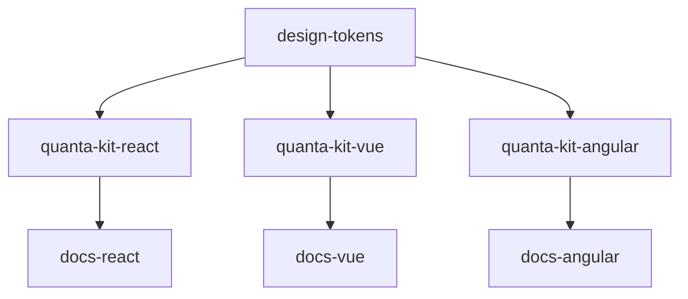
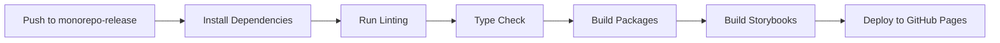
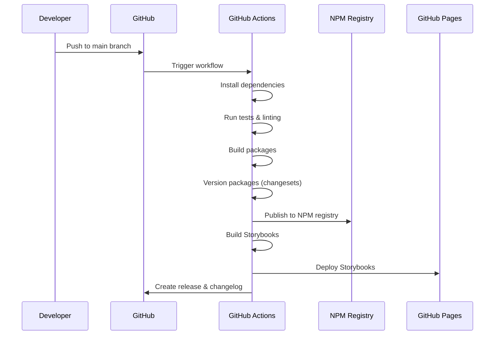

# 🚀 Quanta Kit Design System - Turborepo Setup Guide

Complete step-by-step guide for setting up a multi-framework design system using Turborepo, Changesets, and automated CI/CD.

## 📋 Table of Contents

- [Project Overview](#-project-overview)
- [Architecture](#-architecture)
- [Step-by-Step Setup](#-step-by-step-setup)
- [Turborepo Configuration](#-turborepo-configuration)
- [Changesets Integration](#-changesets-integration)
- [GitHub Actions Pipeline](#-github-actions-pipeline)
- [Development Workflow](#-development-workflow)
- [Deployment Process](#-deployment-process)
- [Troubleshooting](#-troubleshooting)

## 🎯 Project Overview

The Quanta Kit Design System is a monorepo containing:

- **Component Libraries**: React, Vue, and Angular implementations
- **Documentation Apps**: Framework-specific documentation sites
- **Design Tokens**: Shared design variables across all frameworks
- **Storybook Integration**: Interactive component documentation
- **Automated CI/CD**: Testing, building, and deployment pipeline

## 🏗️ Architecture

```
quanta-kit-design-system/
├── packages/
│   ├── quanta-kit-react/          # React component library
│   ├── quanta-kit-vue/            # Vue component library
│   ├── quanta-kit-angular/        # Angular component library
│   └── design-tokens/             # Shared design tokens
├── apps/
│   ├── docs-react/                # React documentation site
│   ├── docs-vue/                  # Vue documentation site
│   └── docs-angular/              # Angular documentation site
├── .github/workflows/
│   └── release.yml                # CI/CD pipeline
├── turbo.json                     # Turborepo configuration
└── package.json                   # Root configuration
```

## 🔧 Step-by-Step Setup

### 1. Initialize the Monorepo

```bash
# Create the project directory
mkdir quanta-kit-design-system
cd quanta-kit-design-system

# Initialize the root package.json
npm init -y

# Install Turborepo globally (optional)
npm install -g turbo

# Install Turborepo as dev dependency
npm install turbo --save-dev
```

### 2. Configure Root Package.json

```json
{
  "name": "quanta-design-system",
  "private": true,
  "scripts": {
    "build": "turbo run build",
    "dev": "turbo run dev",
    "lint": "turbo run lint",
    "storybook": "turbo run storybook",
    "build-storybook": "turbo run build-storybook",
    "format": "prettier --write \"**/*.{ts,tsx,md}\"",
    "check-types": "turbo run check-types",
    "prepare": "husky",
    "changeset": "changeset",
    "version-packages": "changeset version",
    "release": "changeset publish"
  },
  "devDependencies": {
    "@changesets/cli": "^2.29.6",
    "@commitlint/cli": "^19.8.1",
    "@commitlint/config-conventional": "^19.8.1",
    "husky": "^9.1.7",
    "prettier": "^3.6.2",
    "turbo": "^2.5.6",
    "typescript": "5.9.2"
  },
  "engines": {
    "node": ">=18"
  },
  "packageManager": "npm@10.9.2",
  "workspaces": ["apps/*", "packages/*"]
}
```

### 3. Create Turborepo Configuration

```json
// turbo.json
{
  "$schema": "https://turbo.build/schema.json",
  "globalDependencies": ["**/.env.*local"],
  "pipeline": {
    "build": {
      "dependsOn": ["^build"],
      "outputs": ["dist/**", ".next/**", "storybook-static/**"]
    },
    "dev": {
      "cache": false,
      "persistent": true
    },
    "lint": {
      "dependsOn": ["^build"]
    },
    "check-types": {
      "dependsOn": ["^build"]
    },
    "storybook": {
      "cache": false,
      "persistent": true
    },
    "build-storybook": {
      "dependsOn": ["^build"],
      "outputs": ["storybook-static/**"]
    }
  }
}
```

### 4. Set Up Package Structure

```bash
# Create directories
mkdir -p packages/{quanta-kit-react,quanta-kit-vue,quanta-kit-angular,design-tokens}
mkdir -p apps/{docs-react,docs-vue,docs-angular}

# Create .storybook directories for each package
mkdir -p packages/quanta-kit-react/.storybook
mkdir -p packages/quanta-kit-vue/.storybook
mkdir -p packages/quanta-kit-angular/.storybook
```

### 5. Initialize Component Libraries

#### React Package Setup

```bash
cd packages/quanta-kit-react
npm init -y

# Install dependencies
npm install react react-dom
npm install -D @types/react @types/react-dom typescript @storybook/react-vite
```

```json
// packages/quanta-kit-react/package.json
{
  "name": "@quanta-kit/react",
  "version": "0.1.0",
  "main": "dist/index.js",
  "types": "dist/index.d.ts",
  "scripts": {
    "build": "tsc",
    "dev": "tsc --watch",
    "lint": "eslint src/**/*.{ts,tsx}",
    "check-types": "tsc --noEmit",
    "storybook": "storybook dev -p 6006",
    "build-storybook": "storybook build"
  }
}
```

#### Vue Package Setup

```bash
cd packages/quanta-kit-vue
npm init -y

# Install dependencies
npm install vue
npm install -D @vitejs/plugin-vue vite typescript @storybook/vue3-vite
```

#### Angular Package Setup

```bash
cd packages/quanta-kit-angular
npm init -y

# Install Angular dependencies
npm install @angular/core @angular/common
npm install -D @angular/cli @storybook/angular
```

### 6. Configure Changesets

```bash
# Initialize changesets
npx @changesets/cli init
```

```json
// .changeset/config.json
{
  "$schema": "https://unpkg.com/@changesets/config@2.3.1/schema.json",
  "changelog": "@changesets/cli/changelog",
  "commit": false,
  "fixed": [],
  "linked": [],
  "access": "public",
  "baseBranch": "main",
  "updateInternalDependencies": "patch",
  "ignore": ["docs-*"]
}
```

## 🔄 Turborepo Configuration Deep Dive

### Pipeline Explanation

```json
{
  "pipeline": {
    "build": {
      "dependsOn": ["^build"], // Wait for dependencies to build first
      "outputs": ["dist/**", ".next/**"] // Cache these directories
    },
    "dev": {
      "cache": false, // Don't cache dev servers
      "persistent": true // Keep running
    },
    "lint": {
      "dependsOn": ["^build"] // Lint after dependencies are built
    }
  }
}
```

### Dependency Graph



## 📝 Changesets Integration

### Creating a Changeset

```bash
# Add a changeset for new features
npm run changeset

# Example changeset file (.changeset/example.md)
---
"@quanta-kit/react": minor
"@quanta-kit/vue": minor
---

Add new Button component with variants

- Added primary, secondary, and danger variants
- Implemented size options (small, medium, large)
- Added comprehensive Storybook documentation
```

### Version Management

```bash
# Generate new versions based on changesets
npm run version-packages

# Publish packages (CI/CD handles this)
npm run release
```

## 🚀 GitHub Actions Pipeline

### Workflow Structure

```yaml
# .github/workflows/release.yml
name: Release Pipeline

on:
  push:
    branches: [monorepo-release] # Staging branch
  pull_request:
    branches: [monorepo-release]

permissions:
  contents: write
  pages: write
  id-token: write

jobs:
  build: # Build all packages
  deploy-storybooks: # Deploy Storybooks to GitHub Pages
```

### Pipeline Flow



## 💻 Development Workflow

### Daily Development

```bash
# Start all development servers
npm run dev

# This runs:
# - React Storybook on port 6006
# - Vue Storybook on port 6007
# - Angular Storybook on port 6008
# - All documentation sites
```

### Adding New Components

1. **Create the component** in the appropriate package:

```typescript
// packages/quanta-kit-react/src/components/Button/Button.tsx
export interface ButtonProps {
  variant?: 'primary' | 'secondary' | 'danger';
  size?: 'small' | 'medium' | 'large';
  children: React.ReactNode;
}

export const Button: React.FC<ButtonProps> = ({
  variant = 'primary',
  size = 'medium',
  children
}) => {
  return (
    <button className={`btn btn--${variant} btn--${size}`}>
      {children}
    </button>
  );
};
```

2. **Create Storybook stories**:

```typescript
// packages/quanta-kit-react/src/components/Button/Button.stories.tsx
import type { Meta, StoryObj } from "@storybook/react";
import { Button } from "./Button";

const meta: Meta<typeof Button> = {
  title: "Components/Button",
  component: Button,
  parameters: {
    layout: "centered",
  },
  tags: ["autodocs"],
};

export default meta;
type Story = StoryObj<typeof meta>;

export const Primary: Story = {
  args: {
    variant: "primary",
    children: "Button",
  },
};
```

3. **Add changeset**:

```bash
npm run changeset
```

4. **Test and commit**:

```bash
npm run lint
npm run check-types
npm run build
git add .
git commit -m "feat: add Button component"
```

### Branch Strategy

```mermaid
gitgraph
    commit id: "Initial"
    branch feature/button-component
    checkout feature/button-component
    commit id: "Add Button"
    commit id: "Add tests"
    checkout main
    merge feature/button-component
    branch monorepo-release
    checkout monorepo-release
    commit id: "Release prep"
    checkout main
    merge monorepo-release
    commit id: "Release v1.1.0"
```

## 🚀 Deployment Process

### Staging Deployment (monorepo-release branch)

1. **Merge feature branch** to `monorepo-release`:

```bash
git checkout monorepo-release
git merge feature/new-component
git push origin monorepo-release
```

2. **Automated Pipeline** triggers:
   - ✅ Builds all packages
   - ✅ Runs tests and linting
   - ✅ Builds Storybooks
   - ✅ Deploys to GitHub Pages (staging)

3. **Storybook URLs** (staging):
   - React: `https://username.github.io/quanta-kit-design-system/react/`
   - Vue: `https://username.github.io/quanta-kit-design-system/vue/`
   - Angular: `https://username.github.io/quanta-kit-design-system/angular/`

### Production Deployment (main branch)

1. **Review staging** deployment
2. **Merge to main**:

```bash
git checkout main
git merge monorepo-release
git push origin main
```

3. **Production Pipeline** triggers:
   - ✅ All staging checks
   - ✅ Publishes packages to NPM
   - ✅ Updates production Storybooks
   - ✅ Creates GitHub release

### What Happens When Merged to Main



## 📦 Package Publishing

### Automatic Publishing

When changes are merged to `main`:

1. **Changesets** determines new versions
2. **Packages** are built and published to NPM:
   - `@quanta-kit/react@1.2.0`
   - `@quanta-kit/vue@1.2.0`
   - `@quanta-kit/angular@1.2.0`

### Installation by Consumers

```bash
# Install React components
npm install @quanta-kit/react

# Install Vue components
npm install @quanta-kit/vue

# Install Angular components
npm install @quanta-kit/angular
```

### Usage Examples

```tsx
// React usage
import { Button } from "@quanta-kit/react";

function App() {
  return <Button variant="primary">Click me</Button>;
}
```

```vue
<!-- Vue usage -->
<template>
  <QuantaButton variant="primary">Click me</QuantaButton>
</template>

<script setup>
import { QuantaButton } from "@quanta-kit/vue";
</script>
```

```typescript
// Angular usage
import { QuantaKitModule } from "@quanta-kit/angular";

@NgModule({
  imports: [QuantaKitModule],
})
export class AppModule {}
```

## 🔧 Troubleshooting

### Common Issues

#### 1. Build Failures

```bash
# Check for TypeScript errors
npm run check-types

# Check for linting errors
npm run lint

# Build specific package
turbo run build --filter=@quanta-kit/react
```

#### 2. Storybook Issues

```bash
# Clear Storybook cache
npx storybook@latest upgrade

# Rebuild Storybook
npm run build-storybook
```

#### 3. Changeset Problems

```bash
# Check changeset status
npx changeset status

# Remove problematic changeset
rm .changeset/problematic-changeset.md
```

### Pipeline Debugging

```bash
# Run pipeline locally
npm run build
npm run lint
npm run check-types
npm run build-storybook
```

### Cache Issues

```bash
# Clear Turborepo cache
turbo prune

# Clear all node_modules
rm -rf node_modules packages/*/node_modules apps/*/node_modules
npm install
```

## 🎯 Best Practices

### 1. Component Development

- ✅ Write TypeScript interfaces for all props
- ✅ Create comprehensive Storybook stories
- ✅ Include unit tests
- ✅ Add proper JSDoc comments

### 2. Changesets

- ✅ Use semantic versioning correctly
- ✅ Write clear changeset descriptions
- ✅ Group related changes in single changeset

### 3. Git Workflow

- ✅ Use conventional commit messages
- ✅ Test on `monorepo-release` before merging to `main`
- ✅ Keep feature branches focused and small

### 4. Performance

- ✅ Use Turborepo caching effectively
- ✅ Optimize Docker builds with proper `.dockerignore`
- ✅ Tree-shake unused exports

## 📚 Additional Resources

- [Turborepo Documentation](https://turbo.build/repo/docs)
- [Changesets Documentation](https://github.com/changesets/changesets)
- [GitHub Actions Documentation](https://docs.github.com/en/actions)
- [Storybook Documentation](https://storybook.js.org/docs)

---

**Happy coding! 🚀**

\*This setup provides a robust, scalable foundation for maintaining a multi-framework design system with automated testing,
