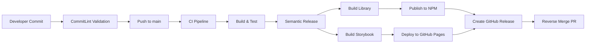

# Quanta Kit Angular - Semantic Release Setup

## 📋 Overview

This document outlines the complete semantic-release automation setup for the `quanta-kit-angular` project. The setup handles:

1. **Angular Library Publishing** - Automated npm package publishing
2. **Storybook Deployment** - Automated GitHub Pages deployment
3. **Version Management** - Semantic versioning with changelog generation
4. **Branch Synchronization** - Automated reverse-merge from main to develop

## 🏗️ Architecture



## 🔧 Configuration Files

### 1. Package.json Scripts

```json
{
  "scripts": {
    "build": "npm run sync-version && ng build",
    "sync-version": "node -e \"const pkg = require('./package.json'); const libPkg = require('./projects/quanta-kit/package.json'); libPkg.version = pkg.version; require('fs').writeFileSync('./projects/quanta-kit/package.json', JSON.stringify(libPkg, null, 2) + '\\n');\"",
    "build-storybook": "ng run quanta-kit:build-storybook",
    "semantic-release": "semantic-release"
  }
}
```

### 2. Semantic Release Configuration (`.releaserc.json`)

```json
{
  "branches": [
    "main",
    {
      "name": "develop",
      "prerelease": "beta"
    }
  ],
  "plugins": [
    "@semantic-release/commit-analyzer",
    "@semantic-release/release-notes-generator",
    "@semantic-release/changelog",
    {
      "plugin": "@semantic-release/npm",
      "config": {
        "pkgRoot": "dist/quanta-kit",
        "tarballDir": "dist"
      }
    },
    "@semantic-release/git",
    "@semantic-release/github"
  ]
}
```

### 3. GitHub Actions Workflow (`.github/workflows/ci.yml`)

Key jobs added:

- **Release Job**: Builds library, publishes to npm, deploys Storybook
- **Reverse Merge Job**: Creates PR to sync main → develop

## 🚀 Release Process

### Automatic Release Flow

1. **Commit Analysis**
   - Scans commits since last release
   - Determines release type (major/minor/patch)
   - Generates release notes

2. **Version Management**
   - Updates root `package.json`
   - Syncs version to library `package.json`
   - Creates git tag

3. **Library Publishing**
   - Builds Angular library (`ng build`)
   - Publishes to npm registry as `quanta-kit`
   - Creates tarball in `dist/` folder

4. **Storybook Deployment**
   - Builds Storybook documentation
   - Deploys to GitHub Pages
   - Available at: `https://marvin-aroza.github.io/quanta-kit-angular/`

5. **GitHub Release**
   - Creates GitHub release with changelog
   - Attaches npm package tarball
   - Tags the release

6. **Branch Synchronization**
   - Creates reverse-merge branch
   - Opens PR: main → develop
   - Syncs version updates and changelog

## 📦 Release Types

Based on conventional commits:

| Commit Type        | Release Type | Example                                   |
| ------------------ | ------------ | ----------------------------------------- |
| `feat:`            | Minor        | `feat(TICKET-123): add new component`     |
| `fix:`             | Patch        | `fix(TICKET-456): resolve button styling` |
| `BREAKING CHANGE:` | Major        | `feat!: remove deprecated API`            |
| `docs:`            | Patch        | `docs(readme): update installation guide` |
| `perf:`            | Patch        | `perf(TICKET-789): optimize bundle size`  |

## 🔑 Required Setup

### 1. NPM Token Configuration

1. **Generate NPM Token:**

   ```bash
   npm login
   npm token create --access=automation
   ```

2. **Add to GitHub Secrets:**
   - Go to repository Settings → Secrets and variables → Actions
   - Add secret: `NPM_TOKEN` with the generated token

### 2. GitHub Pages Setup

1. **Enable GitHub Pages:**
   - Go to repository Settings → Pages
   - Source: Deploy from a branch
   - Branch: `gh-pages` / `/ (root)`

### 3. Branch Protection (Optional)

Protect the `main` branch:

- Go to Settings → Branches
- Add protection rule for `main`
- Enable "Require pull request reviews"

## 🔍 Monitoring & Validation

### Build Outputs

1. **Library Build**: `dist/quanta-kit/`

   ```
   dist/quanta-kit/
   ├── package.json
   ├── index.d.ts
   ├── lib/
   └── public-api.d.ts
   ```

2. **Storybook Build**: `storybook-static/`
   ```
   storybook-static/
   ├── index.html
   ├── static/
   └── stories/
   ```

### Release Validation

1. **NPM Package**: Check https://www.npmjs.com/package/quanta-kit
2. **Storybook**: Visit https://marvin-aroza.github.io/quanta-kit-angular/
3. **GitHub Release**: Check repository releases tab
4. **Reverse Merge**: Monitor PRs for automatic sync

## 🛠️ Development Workflow

### 1. Making Changes

```bash
# Create feature branch
git checkout -b feat/new-component

# Make changes and commit using conventional format
git commit -m "feat(TICKET-123): add new button component"

# Push and create PR to main
git push origin feat/new-component
```

### 2. Release Process

```bash
# Merge PR to main (triggers automatic release)
# OR push directly to main
git checkout main
git commit -m "feat(TICKET-456): add new feature"
git push origin main
```

### 3. Manual Release (if needed)

```bash
# Run semantic release locally
npm run semantic-release
```

## 🧪 Testing the Setup

### 1. Test Build Scripts

```bash
# Test library build
npm run build

# Test Storybook build
npm run build-storybook

# Test version sync
npm run sync-version
```

### 2. Test Commit Validation

```bash
# Valid commit (should pass)
echo "feat(TEST-123): test feature" | npx commitlint

# Invalid commit (should fail)
echo "invalid commit message" | npx commitlint
```

## 🔧 Troubleshooting

### Common Issues

1. **NPM Publish Fails**
   - Check `NPM_TOKEN` secret is set
   - Verify npm package name is unique
   - Ensure package is not private

2. **Storybook Deploy Fails**
   - Check `storybook-static` folder exists after build
   - Verify GitHub Pages is enabled

3. **CommitLint Fails**
   - Use conventional commit format
   - Include ticket number in scope

4. **Version Sync Issues**
   - Check `sync-version` script syntax
   - Verify both package.json files exist

### Debug Commands

```bash
# Check semantic-release dry run
npx semantic-release --dry-run

# Validate commitlint config
npx commitlint --print-config

# Check build outputs
ls -la dist/quanta-kit/
ls -la storybook-static/
```

## 📊 Benefits

### Automation Benefits

- ✅ **Zero-touch releases** - No manual version bumping
- ✅ **Consistent versioning** - Semantic versioning enforced
- ✅ **Automated documentation** - Storybook always up-to-date
- ✅ **Quality gates** - Tests must pass before release
- ✅ **Branch synchronization** - Develop branch stays current

### Developer Experience

- ✅ **Clear commit standards** - Conventional commits enforced
- ✅ **Automated changelogs** - Generated from commits
- ✅ **Fast feedback** - CI/CD provides quick validation
- ✅ **Reliable process** - Consistent release procedure

## 📚 References

- [Semantic Release Documentation](https://semantic-release.gitbook.io/)
- [Conventional Commits](https://conventionalcommits.org/)
- [Angular Library Guide](https://angular.io/guide/creating-libraries)
- [Storybook Documentation](https://storybook.js.org/docs)
- [GitHub Actions](https://docs.github.com/en/actions)

---

**Last Updated**: August 8, 2025  
**Setup Version**: 1.0.0  
**Project**: quanta-kit-angular
